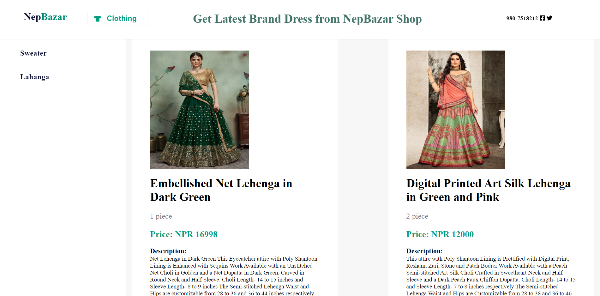

# Ecommerce-web-app-vanillaJS-with-strapi

## Very Small Bazar Business ecommerce clothing web app for latest brand with backend headless Strapi CMS

 # [See Live](https://alidhuniya.github.io/Ecommerce-web-app-vanillaJS-with-strapi/index.html)

 

# Tech Stack

 ### HTML
 ### CSS
 ### JS
 ### Strapi Headless CMS

 # Other

 ### Google Fonts
 ### Font-Awesome Icons

 # Backend Strapi Model 
 ### [Backend Strapi Content Model](https://github.com/Alidhuniya/vanillaJS-Ecommmerce-website-for-very-small-business)

 # What you'll Learn

   **- REST APIs**

   **- How to read DOCS?**

   **- How to work with Strapi CMS?**

   **- JS DOM**

   **- ES6 Syntax**

   **- ES6 Modules**

   **- How to Fetch Data and show on the Screen?**

   **- Async/Await**

   **-  Fetch API**

   **- Responsive Design**

   **- HTML structure with meaningful Classes**

   **- BEM Convention**

   **- Get HTML/CSS  Design only**  [See Live HTML/CSS Design](https://alidhuniya.github.io/HTMLCSS-Projects/Ecom/)

